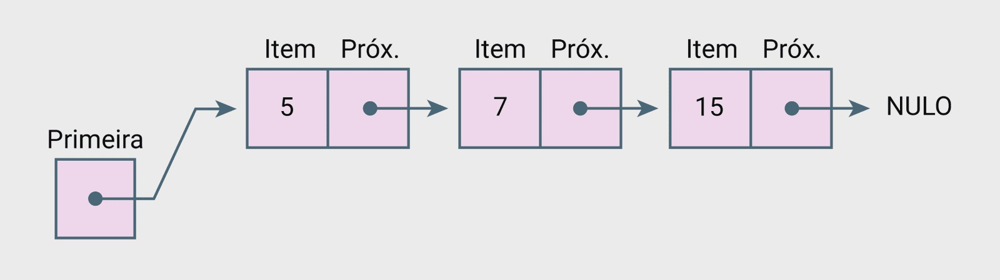

## 1 Modulo: Lista e Ordenação

### Estruturo de dados Lista

> **Lista Linear**
    - Versão estática (Array)
    - Versão Dinâmica:
        Que nos da flexibilidade de expandir o espaço quando necessário

> **Lista Encadeada**
    - Cada intem que você coleta se conecta ao próximo.

Em cada um delas vamos dominar as operações essencias. (Inserir, Percorrer e Remover dados)

## 2 Modulo: Estratégias de Busca

> **Busca Sequêncial:**
    - verifica item por item, simples mais que pode custar um tempo precioso

> **Busca Binaria:**
    - Com os dados organizados ela elimina a metade das possibilidades em cada passo

## 3 Modulo: Métodos de ordenação

> **Bubble Sort**
    - Para entender a lógica de comparar e trocar

> **Select Sort:**
    - Encontra o melhor item e o posiciona corretamente

> **Insertion Sort:**
    - Perfeito para manter a lista organizada em tempo real

## Lista Linear e Lista Linear

**Lista Linear Estática**

> É uma estrutura de dados onde os elementos são guardados em sequência, em oisições de memória que são vizinhas, uma do lado da outra.
> - _IMPORTANTE_: O tamanho total da lista é definido no momento em que a criamos e não pode ser alterado depois, durante a execução do programa.
> Para implementar essa lista usamos estruta vetores (Arrays)
> (L) -> (L + C) -> (L + 2C)
> Ex.:
> int numeros[5] = {10, 20, 30, 40, 50};

**Lista Linear Dinâmica**

Quando não sei exatamento quantos dados vou precisar.
Armazena elementos em sequência, mas tem a incrível capacidade de aumentar ou diminuir de tamanho enquanto o programa está rodando.

Elá aloca e libera memória conforme a nossa necessidade.

Na linguagem C não usamos mais os vetores declarados de forma simples e sim:
- Ponteiros
- Funções:
    malloc
    realloc
    free

Ex.:

- Passo 1: Alocando a memória inicial
int* numeros = (int*) malloc(3 * sizeof(int));
    _"Ei S.O, ne arranja um espaço na memória para guardar 3 números do timpo (int)"_

- Passo 2: Preenchendo a lista
numeros[0] = 10;
numeros[1] = 20;
numeros[2] = 30;

- Passo 3: Realocando a memória para expandir a lista
numeros = (int*) realloc(numeros, 5 * sizeof(int));
    _"Ei, sistema, lembra daquele bloco de memória para 3 inteiros? Eu preciso que ele agora tenha espaço para 5 inteiros"_

Ele tenta expandir o bloco de memória mantendo os dados que já estavam lá.

- Passo 4: Adicionando os novos valores
numero[3] = 40;
numero[4] = 50

Exemplo de Lista Linear Dinâmica
