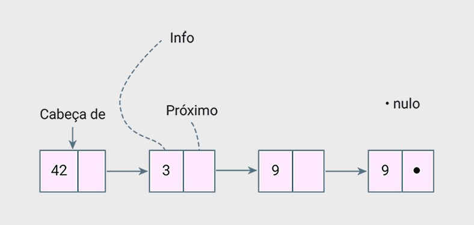
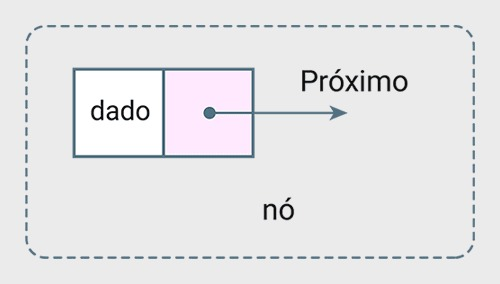
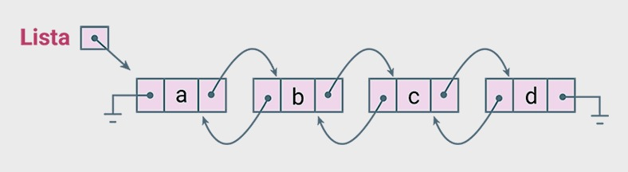
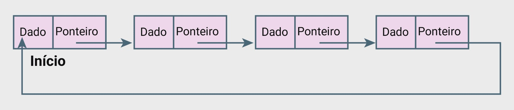
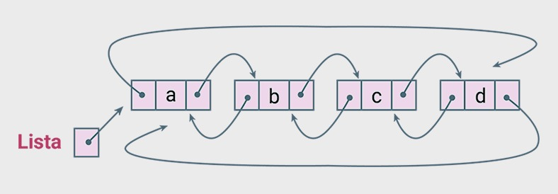

### Lista Encadeada e Dinâmica

Util quando precisamos inserir e remover elementos no meio da lista com frêquencia.
Pense no Vetor dinâmico. Se temos 500 elementos e queremos adicionar um elemento na posição 2. Precisamos empurar todos os outros 498 elementos para frente para poder abrir espaço. 

Isso pode ser lento e custoso computacionalmente.

Para resolver este desafio iremos conhecer a **Lista encadeada**

### LISTA ENCADEADA



#### LISTA ENCADEADA SIMPLES

É uma estrutura de dados dinâmica onde os elementos não precisa estar em posições de memórias vizinhas, como nos vetores.

Cada elemento, nosso nó, é composto por duas partes:
* Dado - enigma ou pista
* Ponteiro - localização da próxima pista



Em liguagem C:

```C
struct No {
    int dados;            // Onde guardamos a informação
    struct No* proximo;   // A "seta" que aponta para o próximo nó
};
```

#### LISTA DUPLAMENTE ENCADEADA

Cada nó, além do dado e do ponteiro para o próximo, também tem um ponteiro para o nó anterior.



Em Linguagem C:

```C
struct No {
    int dado;
    struct No* proximo;
    struct No* anterior;  // A novidade!
};
```

#### LISTA CIRCULAR SIMPLES

Não existe mais um nó final que aponta para NULL.
O último nó aponta de volta para o primeiro, criando um ciclo indefinido.



Em Liguagem C:

```C
struct No {
    int dado;
    struct No* proximo; // o último aponta para o primeiro
}
```

#### LISTA CIRCULAR DUPLAMENTE ENCADEADA

Ela é circular - então não tem começo nem fim.
Ela é duplamente encadeada, o que significa que de qualquer ponto, você pode se mover em qualquer direção, para frente ou para trás, indefinidamente.

Diferente das listas comuns, ela é circular, ou seja, o último nó aponta para o primeiro, e o primeiro, aponta para o último, criando um ciclo fechado em ambas as direções.



#### RESUMO
* Listas encadeadas
Forma de organizar dados conectados por ponteiros

- [x] Lista Simples Encadeada
- [x] Lista Duplamente Encadeada
- [x] Lista Circular
- [x] Lista Circular Duplamente Encadeada

### OPERAÇÕES EM LISTA

#### INSERÇÃO

Insersção no início da lista encadadeada usando C:

```C
// --- A SUA FUNÇÂO ---
// Insere um novo  nó no início da lista.
void inserirNoInicio(Struct No** inicio, int valor){
    // 1. Criamos nosso "novo nó" alocando memória para ele.
    struct No* novo = (struct No*) malloc(sizeof(struct No));

    // Verificação para o caso de falha na alocação de memória
    if(novo == NULL){
        print("Erro: Falha ao alocar memória.\n");
        return;
    }

    // 2. Colocamos o valor dentro dele.
    novo->dado = valor;

    // 3. O "próximo" do nosso novo nó será o antigo início da lista.
    // O ponteiro 'inicio' é um ponteiro para ponteiro, então '*inicio' nos dá
    // o ponteiro para o primeiro nó atual
    novo->proximo = *inicio;

    // 4. Agora, o início da lista passa a ser o nosso novo nó!
    // Modificamos o ponteiro original para que ele aponte para o novo nó.
    *inicio = novo;
}
```

#### REMOÇÃO

Consite em excluir um elemento e garantir que lista continue conectada e funcional

Pense em uma fila de alpenistas conectado uma corda de seguraça. Se um alpinista do meio precisar sair o alpinista de tras conecta sua corda no alpenista mais a frente. Mantendo assim a fila conectada

Listas Encadeadas

Ajustamos os ponteiros para "pular" o nó que queremos remover e, muito importante, liberamos a memória que ele estava usando.

```c
// --- A SUA FUNÇÂO ---
// remove o primeiro nó da lista
void removerDoInicio(struct No** inicio){
    // 1. Primeiro, checamos se a lista não está vazia!
    // Se 'inicio' for NULL ou apontar para NULL, não há nada a remover.
    if(inicio == NULL || *inicio == NULL){
        printf("A lisa já está vazia. Nada a remover.\n");
        return;
    }

    // 2. Guardamos o endereço do nó que vamos remover (o primeiro nó)
    struct No* noParaRemover = *inicio;

    // 3. O início da lista agora passa a ser o segundo nó
    // O ponteiro 'inicio' passa a apontar para o nó seguinte ao que será removido.
    *inicio = (*inicio)->proximo;

    // 4. Liberamos a memória do nó que foi guardado e removido da lista
    free(noParaRemover);
}
```

#### PERCORRIMENTO

É simplesmete o ato de passar por cada um dos seus Nós do início ao fim.

```c
// --- A SUA FUNÇÂO ---
// Percorre a lista a partir do nó inicial e imprime o dado de cada nó.
void listar(struct No* inicio){
    // 1. Criamos o ponteiro "viajante" que começa no início
    struct No* atual = inicio;

    // Se a lista estiver vazia, informamos ao usuário.
    if(atual == NULL){
        printf("A lista está fazia.\n");
        return;
    }

    printf("Elementos da lista:\n");
    // 2. Enquanto nosso viajante não chegar ao fim (NULL)...
    while(atual != NULL){
        // 3. ... mostramos o dado donó onde ele está...
        printf("%d\n", atual->dado);

        // 4. ...e fazemos ele pular para o próximo nó!
        atual = atual->proximo;
    }
}
```